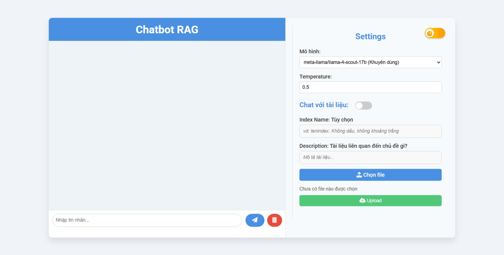

# Chatbot RAG

A modern Retrieval-Augmented Generation (RAG) chatbot system with a FastAPI backend, Elasticsearch integration, and a beautiful web UI. The system supports chatting with documents (PDF, DOCX), real-time search, and multiple LLM models.

## Features

- **Chat with AI**: Natural language chat with various LLMs (Llama, DeepSeek, etc.).
- **Retrieval-Augmented Generation**: Toggle RAG to enhance answers with document/context retrieval.
- **Document Upload**: Upload PDF/DOCX files, index them, and chat with their content.
- **Real-time Search**: Integrates DuckDuckGo and datetime tools for up-to-date information.
- **Modern Web UI**: Responsive, theme-switching, and user-friendly.
- **Elasticsearch Integration**: Stores and retrieves document chunks for RAG.
- **API-first**: FastAPI backend with endpoints for chat and document indexing.

## Project Structure

- `src`: Backend source code (FastAPI, RAG pipeline, LLM, embedding, database, etc.).
- `webUI`: Frontend (HTML, CSS, JS) for chat and document upload.
- `docker-compose.yml`: Multi-service setup (Elasticsearch, Kibana, backend).
- `requirements.txt`: Python dependencies.

## Quick Start

### Prerequisites

- Docker & Docker Compose
- Python 3.10+ (for local development)
- Node.js (optional, for frontend development)

### Steps

1. **Clone the repository**  
    ```bash
    git clone <repository-url>
    cd chatbot
    ```

2. **Configure Environment**  
    Copy and edit `.env` as needed for Elasticsearch, API keys, and model settings.

3. **Start with Docker Compose**  
    This will start:
    - Elasticsearch
    - Kibana (for ES monitoring)
    - The FastAPI backend  
    ```bash
    docker-compose up
    ```

4. **Access the Web UI**  
    Open `index.html` in your browser (or serve via a static server).

5. **API Endpoints**  
    - `POST /api/chat`: Chat with the bot.
    - `POST /api/index`: Upload and index a document.
    - `POST /api/chat_with_instruction`: Chat with custom instructions.

## Development

### Backend

- Navigate to the `src` directory and run the FastAPI server.

### Frontend

- Open `index.html` directly or use a static server.

## Configuration

Edit `config.py` or use environment variables for:

- Elasticsearch endpoint and credentials
- LLM model name and API key
- Embedding model

